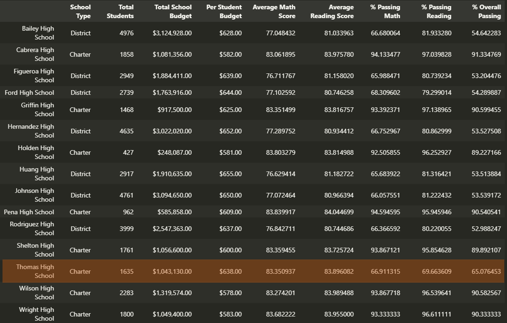

# School_District_Analysis

## Overview

In this module, the *Python's Pandas* library is used to process and analyze standarized student's math and reading test results as well as school's funding data gathered from the school system of the city.

A first school distric analysis was conducted with the **[PyCitySchools](./Module/PyCitySchools.ipynb) jupyter notebook**. Even though it provided insights about the performance of the students and the schools in the city, later on, the school board was notified that there is evidence that the results of the 9th grade students from the Thomas High School were altered.

The school board then decided to invalidate the manipulated results from the **[student's input data](./Resources/students_complete.csv)**. This meant that those values need to be flagged and the school district analysis should be repeated.

With the **[PyCitySchools_Challenge](./PyCitySchools_Challenge.ipynb) jupyter notebook**, the Thomas High School, 9th grade results are dropped and a new school district analysis is conducted. The repeated analysis will help the school board in making strategic decitions to improve the quality of the education system.

Three final deliverables are provided:

- The school district analysys report (This README.md file).
- The **[school district analysis jupyter notebook](./PyCitySchools_Challenge.ipynb)** to flag the invalid results.
- The **[school district analysis jupyter notebook](./PyCitySchools_Challenge.ipynb)** to repeat the school district analysis.

## Results

**1. How is the district summary affected?**

The district summary is a single row table containing information about the schools in the district being analyzed. In this case fifteen schools were analyzed and information such as the total number of students, the total budget destinated to the schools and the standarized math and reading testing results as well as passing statistics are displayed.

The Image 01, shows the school district summary tables for the data before (top) and after (below) the drop of the math and reading scores of the 9th grade students from the Thomas High School.

*Image 01: School Distric Summary Tables*

Some differences can be seen between both tables and ther is a reduction of the average scores and passing percentages due to the edition of the data, however the differences observed are small as the data affected represent only a small sample of all the data averaged here.

**2. How is the school summary affected?**

The school summary is a table showing the information such as the number of students, the budget, the test results and the passing statistics of each school. Keeping in mind that the data edition only affected the Thomas High School, the differences between the tables shown in Images 02a and 02b are narrowed down to this Charter school as indicated by the red squares.  

*Image 02a: School Summary Table before data edition*

*Image 02b: School Summary Table after data edition*

**3. How does replacing the ninth graders’ math and reading scores affect Thomas High?**

After replacing the ninth grade students scores by NaN values, there is a huge drop in the passing math, reading and overall passing percentages for the Thoma High School. This is because all the students, including 9th graders are considered to get the averaged values shown in the table of Image 02b.

**4. School’s performance relative to the other schools?**

Before the edition of the data, the Thomas High was ranked as the top two performance school with an overall passing percentage of 90.95%, just behind the Cabrera High with a 91.33%. However after the edition of the student data, there are two scenarios for the Thomas High.

*Image 04a: Thomas High School Performance Ranking before data edition*

The first scenario would considering the invalid 9th graders results in the school performance statistics, which will lead to a drop in the ranking of the school from the second to the eight position with an overall passing percentage of 65.08%.

*Image 04b: Thomas High School Performance Ranking after data edition (Scenarion 1)*

The second scenario will not consider the 9th graders in the school statistics computation and only the 10th to 12th graders results would be taken into account. This will maintain the ranking of Thomas High in the second position with an overall passing percentage of 90.63%.

*Image 04c: Thomas High School Performance Ranking after data edition (Scenarion 2)*

**5. How does replacing the ninth-grade scores affect the following:**
    - Math and reading scores by grade: 
    - Scores by school spending
    - Scores by school size
    - Scores by school type

## Summary

<!-- Summarize four changes in the updated school district analysis after reading and math scores for the ninth grade at Thomas High School have been replaced with NaNs -->

<!-- 

*Image 3: PyPoll Python 3 script, total number of votes and vote count by county & candidate* -->